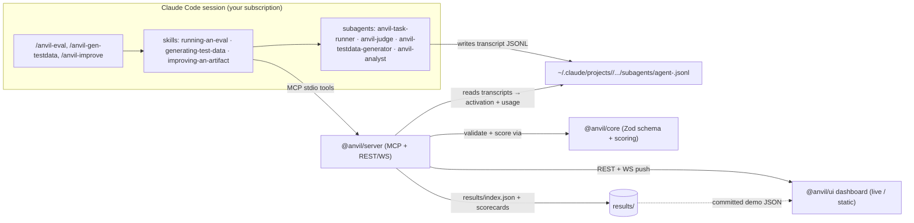

# Claude Code Empowerments

A personal **marketplace** of [Claude Code](https://docs.claude.com/en/docs/claude-code) plugins and skills — empowerments for everyday coding.

This repo is a Claude Code plugin marketplace. Add it once, then browse and install any plugin it offers from inside Claude Code with `/plugin`.

## Install

In any Claude Code session:

```text
/plugin marketplace add LlamaopNV/Claude_Code_Empowerments-
```

Then open the plugin browser and install what you want:

```text
/plugin
```

The plugins appear under the **Discover** tab. Select one, press Enter to view it, and install.

> You can also add the marketplace by full URL:
> `/plugin marketplace add https://github.com/LlamaopNV/Claude_Code_Empowerments-.git`

## Plugins

| Plugin | Category | What it does |
| --- | --- | --- |
| `bake-to-completion` | development | Interviews you about a half-baked software/product idea, stress-tests every aspect, and hands off a strengthened brief for planning. |
| `design-taste-frontend` | development | Anti-slop frontend skill: reads the brief, infers a design direction, and runs a strict pre-flight against AI-design tells. |
| `workflow-forge` | development | Bootstraps a project-tailored CLAUDE.md plus TDD, a pre-commit gate, symmetric-surface audits, and capability sync into any repo. |
| `skill-installer` | development | Browse a bundled catalog of team skills and selectively install them into your user-global or current-project skills directory. |
| `skill-foundry` | development | Authors a new skill, subagent, or plugin to this marketplace's conventions and registers it, then hands off to Anvil for evaluation. |
| `proofmark` | development | The pre-ship static proof for Claude Code artifacts: scans trigger quality, progressive disclosure, anti-slop prose, and manifest drift, then renders a verdict per finding. The cheap gate before Anvil's dynamic eval. |
| `idea-forge` | development | Hardens one clarified idea by making eight rival variants fight an adversarial king-of-the-hill ladder, grafting every fix that survives re-validation, and shipping a result provably no worse than the best original. The depth-on-one companion to `bake-to-completion`. |
| `anvil` | development | Native effectiveness evals & improvement loop for Claude Code skills, subagents & plugins — generate balanced test data, run in-session A/B trials on your subscription, score activation / quality-delta / cost, and propose improvements. **See the [Anvil](#anvil--effectiveness-evals-for-claude-code-artifacts) section below.** |

## Anvil — effectiveness evals for Claude Code artifacts

**Anvil** is the most substantial plugin in this marketplace: a native **plugin + MCP server + local/Pages
dashboard** that measures how effective a **skill**, **subagent**, or **plugin** actually is — and helps you
make it better.

Point Anvil at an artifact from inside Claude Code. It **generates a balanced test suite** for it
(should-fire, should-not-fire near-misses, task cases with rubrics), runs **in-session subagent A/B trials**
on **your own subscription** (no external `claude -p`, no API key), and returns a **scorecard**: activation
precision/recall/F1, with-vs-without **quality delta with confidence intervals**, token cost, and variance.
Then `/anvil-improve` proposes concrete edits and **re-runs to prove the delta**. Everything renders in a
dashboard you can run locally or publish to GitHub Pages.

> **Subscription requirement.** Anvil executes evals **in-session via subagents** (the `Task` tool) on your
> Claude Code subscription. It does not call any metered API and needs no API key. Reported USD cost is a
> token-math **estimate** of an equivalent metered call — a subscription is a flat fee, not billed per run.

### Quickstart

```bash
# 1. From the repo root: install + build the server (it compiles @anvil/core first)
npm ci
npm run build -w @anvil/core
npm run build -w @anvil/server

# 2. (optional) start the companion API + dashboard
npm run build -w @anvil/ui
node packages/server/dist/bin/anvil-server.js serve --port 4319 --ui-dir packages/ui/dist
#    → open http://127.0.0.1:4319
```

Then, inside a Claude Code session with the **anvil** plugin installed (`/plugin` → install anvil; reload
after a rebuild):

```text
/anvil-gen-testdata bake-to-completion     # generate a balanced suite for an artifact
/anvil-eval bake-to-completion --reps 1    # cheap smoke run (then drop --reps for the full run)
/anvil-improve bake-to-completion          # propose edits, re-run, show the measured delta
```

The full step-by-step USER walkthrough is **[docs/running-live.md](docs/running-live.md)**.

### Architecture



- **`@anvil/core`** — the frozen Zod contract (eval suite + result schemas) plus scoring math and transcript
  introspection. **`@anvil/server`** — the MCP stdio server (tools the model calls) + a companion REST/WS API
  for the UI. **`@anvil/ui`** — the dual-mode dashboard (live against the server, or static committed JSON on
  Pages). **`plugins/anvil/`** — the installable commands/skills/subagents.

### Docs

| Doc | What it covers |
| --- | --- |
| [Getting Started](docs/getting-started.md) | Install the plugin + build the server |
| [Generating Test Data](docs/generating-test-data.md) | `/anvil-gen-testdata`, the bucket model, reviewing a suite |
| [Running an Eval](docs/running-an-eval.md) | `/anvil-eval` mechanics, caching, reading a scorecard |
| [Running Live](docs/running-live.md) | The exact ordered steps for your **first real eval** |
| [Metrics Reference](docs/metrics-reference.md) | Each metric, judge/position-swap methodology, role-isolation tradeoff, cost caveat |
| [Improvement Loop](docs/improvement-loop.md) | `/anvil-improve` — propose → confirm → re-run → delta |
| [Architecture](docs/architecture.md) | Plugin + MCP + subagents + UI + the data flow |
| [Releasing](docs/releasing.md) | Versioning, schema-migration policy, cutting a release |

### Live demo

The dashboard is published to GitHub Pages with **illustrative sample data** (clearly labeled — not real
measured runs): **https://llamaopnv.github.io/Claude_Code_Empowerments-/**

> Screenshot/GIF placeholder. To capture one: build the UI (`npm run build -w @anvil/ui`), serve it
> (`node packages/server/dist/bin/anvil-server.js serve --ui-dir packages/ui/dist`), open
> `http://127.0.0.1:4319`, and screenshot the leaderboard + a scorecard into `docs/images/` (then link them
> here).

## Repository layout

```text
.
├── .claude-plugin/
│   └── marketplace.json          # The marketplace catalog (lists every plugin)
├── plugins/
│   └── <plugin-name>/
│       ├── .claude-plugin/
│       │   └── plugin.json        # Plugin manifest
│       └── skills/<skill>/SKILL.md  # Skill(s), with scripts/ alongside as needed
├── .gitattributes                 # forces LF on *.sh so scripts run on every OS
├── CHANGELOG.md
└── README.md
```

## Add your own plugin

> The steps below are the manual version. If you have the `skill-foundry` plugin installed, ask it to do this for you — it follows this exact ritual and runs the validation for you.

1. Create `plugins/<your-plugin-name>/` with a manifest at
   `plugins/<your-plugin-name>/.claude-plugin/plugin.json`:

   ```json
   {
     "name": "your-plugin-name",
     "version": "0.1.0",
     "description": "What your plugin does.",
     "author": { "name": "LlamaopNV" }
   }
   ```

2. Add components in the conventional folders (all optional): `skills/<name>/SKILL.md`,
   `commands/<name>.md`, `agents/<name>.md`, `hooks/hooks.json`, `.mcp.json`.
3. Register it in `.claude-plugin/marketplace.json` by adding an entry to the `plugins` array
   (with `source`, `description`, `version`, `category`).

> **Shell scripts must be LF.** The repo's `.gitattributes` enforces this for `*.sh`. A CRLF
> `.sh` breaks under bash (`bad interpreter`) on every OS, including Git Bash on Windows.

## Validate before you push

```bash
claude plugin validate .
```

This checks the marketplace manifest and every referenced plugin.

## License

MIT
