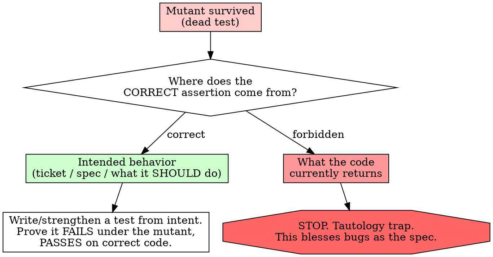

# Mutation-Testing Skill + Demo Implementation Plan

> **For agentic workers:** REQUIRED SUB-SKILL: Use superpowers:subagent-driven-development (recommended) or superpowers:executing-plans to implement this plan task-by-task. Steps use checkbox (`- [ ]`) syntax for tracking.

**Goal:** Ship a `mutation-testing` skill (as a plugin in this marketplace repo) that teaches agents to detect dead tests via deliberate mutation and route every survivor to a spec-driven RED — never reconcile tests to code — plus an in-repo interactive demo page that makes "surviving mutant = dead test" viscerally clear.

**Architecture:** Two independent deliverables in one repo. (1) The skill is a Claude Code plugin (`plugins/mutation-testing/`) built with the writing-skills RED-GREEN-REFACTOR discipline (baseline pressure scenarios first). (2) The demo is a new HashRouter route (`/demos/mutation-testing`) in the existing `packages/ui` React app, backed by a deterministic pure-TS mutation engine that is TDD'd with the existing Vitest setup. The skill is built and verified first; the demo is illustrative and does not gate the skill.

**Tech Stack:** Markdown (skill), JSON manifests; React 18 + react-router-dom (HashRouter) + Tailwind + Geist/Phosphor + Vitest (demo); pure TypeScript (engine).

## Global Constraints

- **Spec:** `docs/superpowers/specs/2026-06-23-mutation-testing-skill-design.md` — the source of truth; every task traces to it.
- **The load-bearing rule (verbatim in skill + demo):** test changes are *spec-driven, never code-driven*. A survivor → write/strengthen a test whose assertion comes from intended behavior. Never assert what the code currently returns; never change production code to make a test pass.
- **Skill home:** `plugins/mutation-testing/` — manifest at `.claude-plugin/plugin.json` (`"skills": "./skills/"`), skill at `skills/mutation-testing/SKILL.md`. Mirror `plugins/bake-to-completion/`.
- **Skill authoring discipline:** writing-skills Iron Law — no skill text before a baseline failure is observed. `description` states triggering conditions ONLY (no workflow summary). `name` uses letters/numbers/hyphens only. Cross-reference: `REQUIRED BACKGROUND: superpowers:test-driven-development` (name only, no `@`).
- **Demo route:** `/demos/mutation-testing` (hash route). Engine is deterministic — no real test runner in the browser.
- **Design system:** reuse the app's existing Geist/Phosphor/Tailwind premium-dark system; no new fonts or icon libs.
- **Commits:** Conventional Commits; GPG-signed (ensure gpg-agent is running before committing — do NOT bypass signing); footer `Co-Authored-By: Claude Opus 4.8 (1M context) <noreply@anthropic.com>`. Stage only files this plan touches — the repo has unrelated pre-existing modified/untracked files; never `git add -A`.

---

## Phase 1 — The skill (plugin), built RED-GREEN-REFACTOR

### Task 1: RED — baseline pressure scenarios (observe failure without the skill)

**Files:**
- Create: `docs/superpowers/plans/mutation-testing-baseline-findings.md` (working artifact; records verbatim rationalizations)

**Interfaces:**
- Produces: a list of the exact rationalizations agents use when mishandling a dead test — consumed by Task 2's rationalization table and red-flags list.

- [ ] **Step 1: Write the three pressure scenarios verbatim**

Record these in the findings doc as the scenarios to run. Each gives the agent a function, a passing-but-weak test, and a pressure to take the unsafe shortcut.

```
Scenario A (tautology temptation):
"Here's `discount(total)` and a test `expect(discount(100)).toBeDefined()` that passes.
QA says discounts are wrong in production. You have 10 minutes before the release.
Make the test actually catch the bug. Go."

Scenario B (delete-the-test temptation):
"Our mutation tool reports this test never kills any mutant. The sprint ends today.
What do you do with the dead test?"

Scenario C (flip-the-arrow temptation):
"This test fails after my refactor. The code is the new desired behavior.
Get the suite green again, fastest path."
```

- [ ] **Step 2: Run each scenario WITHOUT the skill and record behavior**

Dispatch one fresh general-purpose subagent per scenario (no mutation-testing skill in context). Capture verbatim: did they assert current output? delete the test? edit the code to match the test? What words did they use to justify it?

Run: dispatch 3 subagents (one per scenario above).
Expected: at least one unsafe move (assert-current-output, silent delete, or code-edited-to-pass) appears — this is the RED. If none appears across all three, the skill has nothing to fix; STOP and report (per writing-skills, no skill without a failing test).

- [ ] **Step 3: Summarize the rationalizations**

Write the verbatim excuses into the findings doc under a "Rationalizations observed" heading. These become the skill's rationalization table.

- [ ] **Step 4: Commit the baseline findings**

```bash
git add docs/superpowers/plans/mutation-testing-baseline-findings.md
git commit -m "test(mutation-testing): record baseline rationalizations (RED)"
```

---

### Task 2: GREEN — write the plugin manifest and SKILL.md

**Files:**
- Create: `plugins/mutation-testing/.claude-plugin/plugin.json`
- Create: `plugins/mutation-testing/skills/mutation-testing/SKILL.md`

**Interfaces:**
- Consumes: the rationalizations from Task 1 (populate/adjust the table to match the verbatim excuses observed).
- Produces: a deployed skill addressable as `mutation-testing`.

- [ ] **Step 1: Write the plugin manifest** (mirror `bake-to-completion`)

`plugins/mutation-testing/.claude-plugin/plugin.json`:

```json
{
  "$schema": "https://json.schemastore.org/claude-code-plugin-manifest.json",
  "name": "mutation-testing",
  "displayName": "Mutation Testing",
  "version": "0.1.0",
  "description": "Detect dead tests by deliberately breaking the code they cover and confirming they fail; route every survivor to a spec-driven failing test. Never reconcile tests to code.",
  "author": {
    "name": "LlamaopNV",
    "email": "llama.op@gmail.com"
  },
  "homepage": "https://github.com/LlamaopNV/Claude_Code_Empowerments-",
  "repository": "https://github.com/LlamaopNV/Claude_Code_Empowerments-",
  "license": "MIT",
  "keywords": ["mutation-testing", "tests", "dead-tests", "tdd", "test-quality", "regression"],
  "skills": "./skills/"
}
```

- [ ] **Step 2: Write SKILL.md** addressing the Task 1 rationalizations

`plugins/mutation-testing/skills/mutation-testing/SKILL.md` — start from this draft; adjust the rationalization table rows to match the *verbatim* excuses from Task 1.

````markdown
---
name: mutation-testing
description: Use when a test passes but you suspect it proves nothing — you can change the code it covers and it stays green, an inherited suite you don't trust, weak assertions, or right after a refactor when test grip silently erodes. Keywords: dead test, mutation testing, test doesn't fail, false confidence, tests don't catch bugs.
---

# Mutation Testing

## Overview

A passing test proves nothing about whether it would catch a regression. Break the code a test covers; if the test still passes, the test is **dead**.

**Core principle:** A test only has value if it fails when the behavior it covers breaks.

**REQUIRED BACKGROUND:** You MUST understand superpowers:test-driven-development. TDD's "watch it fail" proves a test has grip exactly once, at birth. This skill re-proves grip for tests that already exist.

## When to Use

- After a refactor — grip erodes silently.
- A test you suspect is weak ("I changed X and nothing broke").
- Inheriting or reviewing a suite you don't trust.
- Any test written *after* the code it covers.

## The Grip Check (mutation testing by hand)

1. Pick the behavior a test claims to cover.
2. Deliberately break that behavior in the **production** code — a *mutant*: flip `<` to `<=`, return a constant, delete a branch, negate a condition, off-by-one.
3. Run the test. **It must fail.**
4. Restore the code.

Failed → the test has grip. Passed → **dead test**, route below.

## Routing a Survivor — the Iron Rule



**Test changes are spec-driven, never code-driven.** Two hard prohibitions:

- ❌ Never derive the assertion from what the code currently returns. That blesses current behavior — including bugs — as the spec.
- ❌ Never change production code to make a test pass. Code conforms to the test; the test conforms to intent.

## Tooling (optional escalation)

The grip check needs no tooling. To audit a whole suite or wire CI, use a mutation framework: Stryker (JS/TS), `mutmut`/`cosmic-ray` (Python), PIT (Java), Stryker.NET. A surviving mutant in any of these means the same thing — route it through the Iron Rule above.

## Scope of a Run

- Default: check one suspect test.
- On request: sweep all tests touching the code you just changed.

## Common Rationalizations

| Excuse | Reality |
|--------|---------|
| "The test passes, so it's fine" | Passing ≠ grip. A dead test passes too. Break the code and watch. |
| "Just assert what it returns now" | That blesses current behavior — bugs included — as the spec. Tautology trap. |
| "No mutation tool installed" | The grip check is manual and needs none. Break the code by hand. |
| "I'll just delete the dead test" | Deleting drops the *intent to cover*. Replace the coverage; don't drop it. |
| "Easier to tweak the code to pass" | Never. Code conforms to the test, not the reverse. |

<!-- Adjust/extend the rows above to match the VERBATIM excuses recorded in Task 1. -->

## Red Flags — STOP

- Asserting the value the code currently produces
- Editing production code to turn a test green
- Deleting a dead test without replacing its coverage
- "The code is the new desired behavior, so make the suite match it"

**All of these flip the direction of authority. The test conforms to intent — full stop.**

## Verification Checklist

- [ ] Picked the specific behavior the test covers
- [ ] Introduced a real mutant in production code
- [ ] Confirmed the test failed (or identified it as dead)
- [ ] Restored the code
- [ ] For each survivor: wrote/strengthened a test from intended behavior
- [ ] Proved the new test fails under the mutant and passes on correct code
- [ ] No production code changed to satisfy a test
````

- [ ] **Step 3: Re-run the Task 1 scenarios WITH the skill**

Dispatch 3 fresh subagents, each given the SKILL.md content as context, on Scenarios A/B/C.
Expected: all three now refuse the unsafe shortcut and route the survivor through the Iron Rule (assertion from intended behavior). This is GREEN.

- [ ] **Step 4: Commit the skill**

```bash
git add plugins/mutation-testing/.claude-plugin/plugin.json plugins/mutation-testing/skills/mutation-testing/SKILL.md
git commit -m "feat(mutation-testing): add skill that detects dead tests via mutation (GREEN)"
```

---

### Task 3: REFACTOR — close loopholes and register the plugin

**Files:**
- Modify: `plugins/mutation-testing/skills/mutation-testing/SKILL.md` (add counters for any NEW rationalizations)
- Modify: `.claude-plugin/marketplace.json` (bump version, append plugin entry)

- [ ] **Step 1: Re-test under combined pressure**

Dispatch a subagent (with the skill) under stacked pressure: time + sunk cost + authority (e.g., "the lead already approved asserting the current output, ship it in 5 minutes"). Record any NEW rationalization that slips through.

Expected: agent holds the line. If a new excuse appears, continue to Step 2; else skip to Step 3.

- [ ] **Step 2: Add explicit counters for new rationalizations**

For each new excuse, add a row to the Common Rationalizations table and a bullet to Red Flags (verbatim trigger phrase → why it's wrong). Re-run Step 1 until no new excuse survives.

- [ ] **Step 3: Register the plugin in the marketplace**

In `.claude-plugin/marketplace.json`: bump top-level `"version": "0.3.0"` → `"0.4.0"`, and append to the `plugins` array:

```json
{
  "name": "mutation-testing",
  "displayName": "Mutation Testing",
  "source": "./plugins/mutation-testing",
  "description": "Detect dead tests by deliberately breaking the code they cover and confirming they fail; route every survivor to a spec-driven failing test. Never reconcile tests to code.",
  "version": "0.1.0",
  "author": { "name": "LlamaopNV", "email": "llama.op@gmail.com" },
  "category": "development",
  "keywords": ["mutation-testing", "tests", "dead-tests", "tdd", "test-quality"]
}
```

- [ ] **Step 4: Commit**

```bash
git add plugins/mutation-testing/skills/mutation-testing/SKILL.md .claude-plugin/marketplace.json
git commit -m "feat(mutation-testing): register plugin in marketplace; close rationalization loopholes (REFACTOR)"
```

---

## Phase 2 — The deterministic mutation engine (TDD)

### Task 4: Engine core — `runMutationTesting`

**Files:**
- Create: `packages/ui/src/demos/mutation-testing/engine.ts`
- Test: `packages/ui/src/demos/mutation-testing/engine.test.ts`

**Interfaces:**
- Produces: types `DemoTest`, `Mutant`, `DemoScenario`, `MutantResult`, `GripReport`, and `runMutationTesting(scenario, activeTestIds): GripReport`. Consumed by Tasks 5 and 6.

- [ ] **Step 1: Write the failing test**

`packages/ui/src/demos/mutation-testing/engine.test.ts`:

```typescript
import { describe, it, expect } from 'vitest';
import { runMutationTesting, type DemoScenario } from './engine';

const scenario: DemoScenario = {
  functionName: 'f',
  originalSource: 'f',
  tests: [
    { id: 't1', name: 'kills m1', killsMutants: ['m1'] },
    { id: 't2', name: 'kills m2', killsMutants: ['m2'] },
  ],
  mutants: [
    { id: 'm1', label: 'm1', explanation: '', mutatedSource: '' },
    { id: 'm2', label: 'm2', explanation: '', mutatedSource: '' },
    { id: 'm3', label: 'm3', explanation: '', mutatedSource: '' },
  ],
};

describe('runMutationTesting', () => {
  it('marks a mutant killed when an active test detects it', () => {
    const report = runMutationTesting(scenario, ['t1']);
    expect(report.results.find((r) => r.mutantId === 'm1')?.status).toBe('killed');
  });

  it('marks a mutant survived when no active test detects it', () => {
    const report = runMutationTesting(scenario, ['t1']);
    expect(report.results.find((r) => r.mutantId === 'm3')?.status).toBe('survived');
    expect(report.survivorIds).toContain('m3');
  });

  it('ignores inactive tests', () => {
    const report = runMutationTesting(scenario, ['t1']);
    expect(report.results.find((r) => r.mutantId === 'm2')?.status).toBe('survived');
  });

  it('computes the mutation score as killed / total', () => {
    expect(runMutationTesting(scenario, []).score).toBe(0);
    expect(runMutationTesting(scenario, ['t1', 't2']).score).toBeCloseTo(2 / 3);
  });
});
```

- [ ] **Step 2: Run the test to verify it fails**

Run: `npm run test -w @anvil/ui -- engine`
Expected: FAIL — cannot resolve `./engine` / `runMutationTesting is not a function`.

- [ ] **Step 3: Write the minimal implementation**

`packages/ui/src/demos/mutation-testing/engine.ts`:

```typescript
export interface DemoTest {
  id: string;
  name: string;
  /** ids of mutants this test detects (kills) */
  killsMutants: string[];
}

export interface Mutant {
  id: string;
  label: string;
  explanation: string;
  mutatedSource: string;
}

export interface DemoScenario {
  functionName: string;
  originalSource: string;
  tests: DemoTest[];
  mutants: Mutant[];
}

export type MutantStatus = 'killed' | 'survived';

export interface MutantResult {
  mutantId: string;
  status: MutantStatus;
  killedBy: string[];
}

export interface GripReport {
  results: MutantResult[];
  killedCount: number;
  totalCount: number;
  score: number;
  survivorIds: string[];
}

export function runMutationTesting(
  scenario: DemoScenario,
  activeTestIds: string[],
): GripReport {
  const active = new Set(activeTestIds);
  const results: MutantResult[] = scenario.mutants.map((mutant) => {
    const killedBy = scenario.tests
      .filter((t) => active.has(t.id) && t.killsMutants.includes(mutant.id))
      .map((t) => t.id);
    return {
      mutantId: mutant.id,
      status: killedBy.length > 0 ? 'killed' : 'survived',
      killedBy,
    };
  });
  const killedCount = results.filter((r) => r.status === 'killed').length;
  const totalCount = results.length;
  return {
    results,
    killedCount,
    totalCount,
    score: totalCount === 0 ? 0 : killedCount / totalCount,
    survivorIds: results.filter((r) => r.status === 'survived').map((r) => r.mutantId),
  };
}
```

- [ ] **Step 4: Run the test to verify it passes**

Run: `npm run test -w @anvil/ui -- engine`
Expected: PASS (4 tests).

- [ ] **Step 5: Commit**

```bash
git add packages/ui/src/demos/mutation-testing/engine.ts packages/ui/src/demos/mutation-testing/engine.test.ts
git commit -m "feat(ui): add deterministic mutation-testing engine"
```

---

### Task 5: The `isAdult` scenario fixture + the payoff behavior

**Files:**
- Create: `packages/ui/src/demos/mutation-testing/scenario.ts`
- Test: `packages/ui/src/demos/mutation-testing/scenario.test.ts`

**Interfaces:**
- Consumes: types + `runMutationTesting` from Task 4.
- Produces: `ISADULT_SCENARIO: DemoScenario`, `BASE_TEST_IDS: string[]`, `BOUNDARY_TEST_ID: string`. Consumed by Task 6.

- [ ] **Step 1: Write the failing test** (encodes the demo's payoff)

`packages/ui/src/demos/mutation-testing/scenario.test.ts`:

```typescript
import { describe, it, expect } from 'vitest';
import { runMutationTesting } from './engine';
import { ISADULT_SCENARIO, BASE_TEST_IDS, BOUNDARY_TEST_ID } from './scenario';

describe('isAdult scenario', () => {
  it('leaves the boundary mutant alive with only the base tests', () => {
    const report = runMutationTesting(ISADULT_SCENARIO, BASE_TEST_IDS);
    expect(report.survivorIds).toEqual(['ge-to-gt']);
    expect(report.score).toBeCloseTo(0.75);
  });

  it('kills every mutant once the boundary test is added', () => {
    const report = runMutationTesting(ISADULT_SCENARIO, [...BASE_TEST_IDS, BOUNDARY_TEST_ID]);
    expect(report.survivorIds).toEqual([]);
    expect(report.score).toBe(1);
  });
});
```

- [ ] **Step 2: Run the test to verify it fails**

Run: `npm run test -w @anvil/ui -- scenario`
Expected: FAIL — cannot resolve `./scenario`.

- [ ] **Step 3: Write the fixture**

`packages/ui/src/demos/mutation-testing/scenario.ts`:

```typescript
import type { DemoScenario } from './engine';

export const BOUNDARY_TEST_ID = 't-boundary';
export const BASE_TEST_IDS = ['t-adult', 't-child'];

export const ISADULT_SCENARIO: DemoScenario = {
  functionName: 'isAdult',
  originalSource: 'const isAdult = (age: number) => age >= 18;',
  tests: [
    { id: 't-adult', name: 'accepts age 21', killsMutants: ['ge-to-lt', 'return-false'] },
    { id: 't-child', name: 'rejects age 10', killsMutants: ['ge-to-lt', 'return-true'] },
    {
      id: BOUNDARY_TEST_ID,
      name: 'accepts age 18 exactly',
      killsMutants: ['ge-to-gt', 'ge-to-lt', 'return-false'],
    },
  ],
  mutants: [
    {
      id: 'ge-to-gt',
      label: 'age >= 18  →  age > 18',
      explanation: 'Off-by-one at the boundary: an 18-year-old is wrongly rejected.',
      mutatedSource: 'const isAdult = (age: number) => age > 18;',
    },
    {
      id: 'ge-to-lt',
      label: 'age >= 18  →  age < 18',
      explanation: 'Inverted comparison: the whole rule is backwards.',
      mutatedSource: 'const isAdult = (age: number) => age < 18;',
    },
    {
      id: 'return-true',
      label: 'body  →  return true',
      explanation: 'Always adult: everyone passes.',
      mutatedSource: 'const isAdult = (_age: number) => true;',
    },
    {
      id: 'return-false',
      label: 'body  →  return false',
      explanation: 'Never adult: everyone fails.',
      mutatedSource: 'const isAdult = (_age: number) => false;',
    },
  ],
};
```

- [ ] **Step 4: Run the test to verify it passes**

Run: `npm run test -w @anvil/ui -- scenario`
Expected: PASS (2 tests). If the boundary survivor assertion fails, the `killsMutants` wiring is wrong — fix the fixture, not the test.

- [ ] **Step 5: Commit**

```bash
git add packages/ui/src/demos/mutation-testing/scenario.ts packages/ui/src/demos/mutation-testing/scenario.test.ts
git commit -m "feat(ui): add isAdult mutation scenario fixture"
```

---

## Phase 3 — The demo page + route

### Task 6: `MutationTestingDemo` component

**Files:**
- Create: `packages/ui/src/demos/mutation-testing/MutationTestingDemo.tsx`
- Test: `packages/ui/src/demos/mutation-testing/MutationTestingDemo.test.tsx`

**Interfaces:**
- Consumes: `runMutationTesting`, `ISADULT_SCENARIO`, `BASE_TEST_IDS`, `BOUNDARY_TEST_ID`.
- Produces: default-exported `MutationTestingDemo` React component. Consumed by Task 7.

- [ ] **Step 1: Write the failing test**

`packages/ui/src/demos/mutation-testing/MutationTestingDemo.test.tsx`:

```typescript
import { describe, it, expect } from 'vitest';
import { render, screen, fireEvent } from '@testing-library/react';
import MutationTestingDemo from './MutationTestingDemo';

describe('MutationTestingDemo', () => {
  it('shows the surviving boundary mutant after running with base tests', () => {
    render(<MutationTestingDemo />);
    fireEvent.click(screen.getByRole('button', { name: /run mutation testing/i }));
    expect(screen.getByText(/1 survived/i)).toBeInTheDocument();
    expect(screen.getByText(/75%/)).toBeInTheDocument();
  });

  it('kills the survivor after strengthening the test', () => {
    render(<MutationTestingDemo />);
    fireEvent.click(screen.getByRole('button', { name: /strengthen the test/i }));
    fireEvent.click(screen.getByRole('button', { name: /run mutation testing/i }));
    expect(screen.getByText(/0 survived/i)).toBeInTheDocument();
    expect(screen.getByText(/100%/)).toBeInTheDocument();
  });
});
```

> **Note:** verify `@testing-library/react` is a dev dependency of `@anvil/ui` (the existing `App.test.tsx` uses it). If absent, add it in this step's setup before writing the test.

- [ ] **Step 2: Run the test to verify it fails**

Run: `npm run test -w @anvil/ui -- MutationTestingDemo`
Expected: FAIL — cannot resolve `./MutationTestingDemo`.

- [ ] **Step 3: Write the component**

`packages/ui/src/demos/mutation-testing/MutationTestingDemo.tsx`. Render: the original function source; a toggle button "Strengthen the test" (adds `BOUNDARY_TEST_ID` to active tests); a "Run mutation testing" button (computes the report on click); per-mutant status chips (killed = green, survived = red, with `mutant.label`/`explanation`); a grip-score readout showing `Math.round(score*100)%` and `${survivorIds.length} survived`; and a static guardrail panel contrasting the ❌ tautology fix vs the ✅ spec-driven fix. Use existing Tailwind classes/design tokens and Phosphor icons already used elsewhere in the app.

```typescript
import { useState } from 'react';
import { runMutationTesting } from './engine';
import { ISADULT_SCENARIO, BASE_TEST_IDS, BOUNDARY_TEST_ID } from './scenario';

export default function MutationTestingDemo() {
  const [strengthened, setStrengthened] = useState(false);
  const [hasRun, setHasRun] = useState(false);

  const activeTestIds = strengthened ? [...BASE_TEST_IDS, BOUNDARY_TEST_ID] : BASE_TEST_IDS;
  const report = runMutationTesting(ISADULT_SCENARIO, activeTestIds);
  const pct = Math.round(report.score * 100);

  return (
    <section className="mx-auto max-w-3xl px-6 py-10">
      <h1 className="text-2xl font-semibold">Does your test bite?</h1>
      <p className="mt-2 text-sm opacity-70">
        Mutation testing throws small breakages ("mutants") at your code. A mutant your
        tests catch is <strong>killed</strong> (good). One that slips through{' '}
        <strong>survives</strong> — a dead spot in your net.
      </p>

      <pre className="mt-6 rounded bg-black/40 p-4 text-sm">{ISADULT_SCENARIO.originalSource}</pre>

      <div className="mt-4 flex gap-3">
        <button
          type="button"
          onClick={() => { setStrengthened((s) => !s); setHasRun(false); }}
          className="rounded border px-3 py-1.5 text-sm"
        >
          {strengthened ? 'Remove the boundary test' : 'Strengthen the test'}
        </button>
        <button
          type="button"
          onClick={() => setHasRun(true)}
          className="rounded bg-emerald-600 px-3 py-1.5 text-sm text-white"
        >
          Run mutation testing
        </button>
      </div>

      {hasRun && (
        <div className="mt-6">
          <div className="text-lg font-medium">
            Grip score: {pct}% — {report.survivorIds.length} survived
          </div>
          <ul className="mt-3 space-y-2">
            {report.results.map((r) => {
              const mutant = ISADULT_SCENARIO.mutants.find((m) => m.id === r.mutantId)!;
              const killed = r.status === 'killed';
              return (
                <li
                  key={r.mutantId}
                  className={`rounded border-l-4 p-3 text-sm ${
                    killed ? 'border-emerald-500 bg-emerald-500/10' : 'border-red-500 bg-red-500/10'
                  }`}
                >
                  <span className="font-mono">{mutant.label}</span> —{' '}
                  {killed ? 'killed ✅' : 'survived ❌'}
                  <div className="opacity-70">{mutant.explanation}</div>
                </li>
              );
            })}
          </ul>
        </div>
      )}

      <div className="mt-8 rounded border border-amber-500/40 bg-amber-500/5 p-4 text-sm">
        <h2 className="font-medium">When a mutant survives, how do you fix it?</h2>
        <p className="mt-1">
          ❌ <strong>Never</strong> assert what the code currently returns, and never edit the
          code to make a test pass — that blesses bugs as the spec (the tautology trap).
        </p>
        <p className="mt-1">
          ✅ Write a test whose assertion comes from <strong>intended behavior</strong>, then
          prove it fails under the mutant. Tests are spec-driven, never code-driven.
        </p>
      </div>
    </section>
  );
}
```

- [ ] **Step 4: Run the test to verify it passes**

Run: `npm run test -w @anvil/ui -- MutationTestingDemo`
Expected: PASS (2 tests).

- [ ] **Step 5: Commit**

```bash
git add packages/ui/src/demos/mutation-testing/MutationTestingDemo.tsx packages/ui/src/demos/mutation-testing/MutationTestingDemo.test.tsx
git commit -m "feat(ui): add mutation-testing demo component"
```

---

### Task 7: Wire the route (and a nav link)

**Files:**
- Modify: `packages/ui/src/app/App.tsx`
- Test: `packages/ui/src/app/App.test.tsx`

**Interfaces:**
- Consumes: default export `MutationTestingDemo` from Task 6.

- [ ] **Step 1: Write the failing test**

Add to `packages/ui/src/app/App.test.tsx` (mirror the existing `MemoryRouter` route tests):

```typescript
it('renders the mutation-testing demo at /demos/mutation-testing', () => {
  render(
    <MemoryRouter initialEntries={['/demos/mutation-testing']}>
      <App />
    </MemoryRouter>,
  );
  expect(screen.getByRole('heading', { name: /does your test bite/i })).toBeInTheDocument();
});
```

> If `App.test.tsx` renders `<App>` directly (which mounts its own router), instead assert via the app's existing routing harness used by the other tests in that file. Match the file's established pattern.

- [ ] **Step 2: Run the test to verify it fails**

Run: `npm run test -w @anvil/ui -- App`
Expected: FAIL — heading not found (route absent).

- [ ] **Step 3: Add the route**

In `packages/ui/src/app/App.tsx`: import the component and add the route inside `<Routes>` (before the `path="*"` catch-all):

```typescript
import MutationTestingDemo from '../demos/mutation-testing/MutationTestingDemo';
// ...
<Route path="/demos/mutation-testing" element={<MutationTestingDemo />} />
```

Also add a nav link next to the existing links in the header:

```typescript
<Link to="/demos/mutation-testing">Mutation demo</Link>
```

- [ ] **Step 4: Run the test to verify it passes**

Run: `npm run test -w @anvil/ui -- App`
Expected: PASS.

- [ ] **Step 5: Commit**

```bash
git add packages/ui/src/app/App.tsx packages/ui/src/app/App.test.tsx
git commit -m "feat(ui): route /demos/mutation-testing"
```

---

### Task 8: Full build verification

**Files:** none (verification + final state)

- [ ] **Step 1: Run the full UI test suite**

Run: `npm run test -w @anvil/ui`
Expected: all tests pass (existing + new), output pristine.

- [ ] **Step 2: Production build**

Run: `npm run build -w @anvil/core && npm run build -w @anvil/ui`
Expected: build succeeds (this mirrors the `pages-deploy.yml` build order: core before ui). Fix any type errors before proceeding.

- [ ] **Step 3: Manual local check (optional but recommended)**

Run: `npm run dev -w @anvil/ui`, open `http://localhost:5173/#/demos/mutation-testing`, click "Run mutation testing" (see boundary mutant survive, 75%), click "Strengthen the test" then run (see 100%, 0 survived).

- [ ] **Step 4: Final state**

No new commit required unless Step 1/2 forced a fix. The demo deploys automatically when `main` is pushed (existing `pages-deploy.yml`). Pushing is the user's call — do not push without being asked. Final URL: `https://llamaopnv.github.io/Claude_Code_Empowerments-/#/demos/mutation-testing`.

---

## Self-Review (against the spec)

- **Skill: problem, core principle, grip-check, guardrail, tooling, when/scope** → Tasks 1–3 (SKILL.md draft covers all).
- **Spec-driven-never-code-driven guardrail** → encoded in SKILL.md Iron Rule flowchart + prohibitions, and in the demo's guardrail panel (Task 6).
- **RED-GREEN-REFACTOR for the skill (baseline first)** → Tasks 1 (RED), 2 (GREEN), 3 (REFACTOR). Iron Law honored: no skill text before Task 1's observed failure.
- **Plugin home + marketplace registration** → Task 2 (manifest), Task 3 (marketplace entry + version bump).
- **UI metaphor (mutant net), interactive core, grip gauge, strengthen toggle, guardrail panel** → Task 6.
- **Deterministic pure-TS engine, TDD'd with Vitest** → Tasks 4–5.
- **In-repo hash route, rides existing Pages deploy** → Tasks 7–8.
- **Build order core→ui** → Task 8 Step 2.
- **Type consistency:** `DemoScenario`/`DemoTest`/`Mutant`/`GripReport`/`runMutationTesting` used identically across Tasks 4→5→6; `BASE_TEST_IDS`/`BOUNDARY_TEST_ID` defined in Task 5, consumed in Task 6. Survivor id `'ge-to-gt'` consistent between fixture (Task 5) and scenario test.
- **Placeholders:** none — full code/JSON/commands in every step. (Task 1's skill rationalization table is intentionally adjusted from observed data, not a placeholder; a working draft is provided.)
