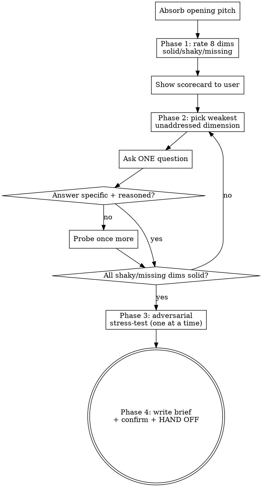

# Bake to Completion

## Overview

Take a half-baked software/product idea and bake it to done: an adaptive, Socratic interview that strengthens **every aspect** of the idea, then hands off a clean brief to design and planning.

**Core principle:** An idea gets stronger from *one question at a time*, adaptive depth, and an *adversarial stress-test* — NOT from a batch of questions and a polished plan you wrote yourself. Cover every dimension, drill only the weak ones, attack the idea before you document it, then **hand off** — do not write the execution plan inline.

## When to Use

- User says "interview me about my idea," "help me flesh out / validate / pressure-test / strengthen my idea."
- An early-stage or vague concept that needs sharpening before a design or build plan.

**When NOT to use:** the concept is already validated and the user wants design/architecture (go straight to `superpowers:brainstorming`) or an implementation plan (`superpowers:writing-plans`).

## The Iron Rules

1. **One question per message.** Never batch. Each answer shapes the next question. Batching is the #1 baseline failure — resist it.
2. **You do NOT write the execution plan.** Your output is a *strengthened idea brief*, then a handoff. Writing scope/timeline/architecture yourself is out of scope.
3. **The adversarial phase is mandatory.** Even a great-sounding idea gets stress-tested. Skipping it because "the idea is strong" defeats the purpose.
4. **Cover all 8 dimensions.** Drilling depth is adaptive; coverage is not optional.

## The 8 Dimensions (coverage guarantee)

| # | Dimension | The question it answers |
|---|-----------|------------------------|
| 1 | Problem | What pain, how real, how frequent, what evidence? |
| 2 | Target user | Who *specifically* — and how do they cope today? |
| 3 | Value proposition | What it does, why it beats the status quo |
| 4 | Differentiation | What already exists, why yours wins |
| 5 | Scope / MVP | Smallest valuable version + what's explicitly OUT |
| 6 | Feasibility | Tech, time, budget, skills, dependencies |
| 7 | Risks & assumptions | The one assumption that, if false, kills it |
| 8 | Validation | Cheapest test of that assumption + what success looks like |

## The 4-Phase Engine

**Phase 1 — Breadth scan.** Read the user's pitch. Rate all 8 dimensions **solid / shaky / missing** *from what they already said* — never re-ask what's answered. Ask at most 1–2 broad orienting questions to fill the biggest blanks. **End the phase by showing the user the scorecard** (a short table: dimension → rating) so they see where the idea is strong vs. weak and agree on what to drill. This buy-in step is not optional.

**Phase 2 — Adaptive deep-dives.** Socratic, **one question at a time**, only on shaky/missing dimensions. A dimension is "done" only when the user states it *specifically, with reasoning* — vague or hand-wavy answers get exactly one more probe. When an answer exposes a weakness, you may *offer* a sharpening suggestion ("one option is X — does that fit?") but never put words in their mouth or fill the gap for them. Reflect each answer back in one line before moving on.

**Phase 3 — Adversarial stress-test (the part that actually strengthens).** Switch to devil's advocate. Surface these one at a time, each as its own message:
- The **strongest steelmanned objection** to the idea.
- The **riskiest hidden assumption** — the one that kills it if false.
- **"Why hasn't someone already done this? / why now?"**
- A **scope-creep check** — what they're tempted to add that the MVP doesn't need.

For each, record either a real mitigation or an honest open risk. Don't let the user off easy, and don't soften a real problem into a compliment.

**Phase 4 — Synthesis & handoff.** Write the brief (template below), show it, ask for confirmation/edits. Then **hand off** (see Handoff). You do not produce scope, timeline, or architecture — that is the job of the skills you hand off to.

## The Idea Brief

Save to `./idea-briefs/YYYY-MM-DD-<slug>.md` (today's date). Sections:

- **One-line pitch**
- **Problem & evidence**
- **Target user** (specific)
- **Value proposition**
- **Scope** — MVP + explicitly out-of-scope
- **Differentiation**
- **Key risks & assumptions** — each with mitigation or "open"
- **Validation plan** — cheapest test of the riskiest assumption + success criteria
- **Open questions for the design phase**

## Handoff

After the user approves the brief:

> "Brief saved to `<path>`. The idea is baked. I'll hand off to the design phase."

Then invoke **`superpowers:brainstorming`**, telling it the concept is already validated and pointing it at the brief file so it skips concept-level questions and focuses on design/architecture. Brainstorming flows into `superpowers:writing-plans` as it normally does. **Do not invoke any other skill, and do not write the plan yourself.**

> Note: the `superpowers:*` handoff skills come from the [superpowers](https://github.com/obra/superpowers) marketplace. If they aren't installed, fall back to your normal design/planning workflow after the brief is written — the brief is designed to feed any planning process.

## Red Flags — STOP

| Thought | Reality |
|---------|---------|
| "I'll ask these 3 related questions together to save time" | Batching kills adaptivity. One question. Wait. Then decide the next. |
| "The idea sounds strong, I can skip the stress-test" | The stress-test is the value. A strong-sounding idea hides the riskiest assumptions. |
| "They gave a vague answer, I'll move on" | Vague = unstrengthened. Probe exactly once more. |
| "Let me just write them a great build plan" | Out of scope. Produce the brief and hand off. Planning is the next skill's job. |
| "I'll cover differentiation/validation if it comes up" | Coverage is guaranteed, not opportunistic. All 8 dimensions, every time. |
| "I'll skip the scorecard and just start drilling" | The scorecard is the user's map and buy-in. Show it before Phase 2. |
| "No need to save a file" | The brief is the artifact the handoff depends on. Save it. |
| "This idea is in [non-software] domain, close enough" | This skill is tuned for software/product. If it's not, say so rather than forcing it. |

## Common Mistakes

- **Front-loading questions** instead of letting answers steer. → One at a time.
- **Interrogation without contribution** — only asking, never offering a sharpening option when the user is stuck.
- **Soft adversarial phase** — lobbing easy objections you immediately answer for them. Make the objection land.
- **Re-asking what the pitch already covered** — rate in Phase 1, then skip solids.
