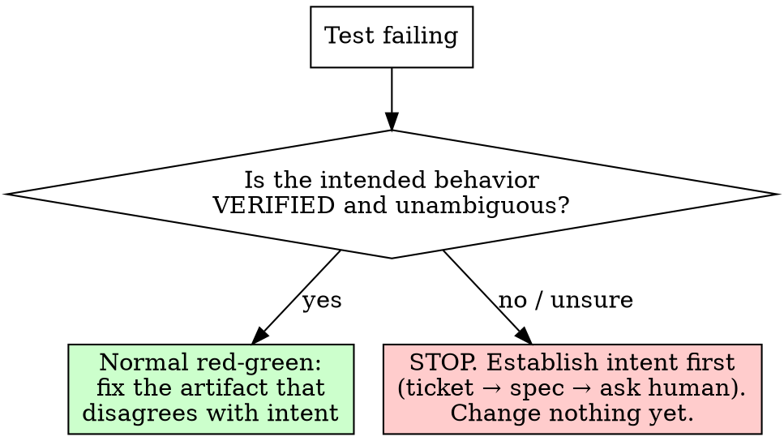

# Establishing Intent Before Resolving a Failing Test

## Overview

A failing test means the code and the test disagree. At least one of them is wrong. **You cannot know which without knowing the intended behavior.**

**Core principle:** A failing test is a question, not always the answer. Establish intent before you change code OR the test.

**REQUIRED BACKGROUND:** superpowers:test-driven-development. TDD says "the test is the spec — fix the code, not the test." That holds *only* when the test correctly encodes **verified** intent. This skill is what you do when it might not.

## The Trap

Under pressure the reflex is to make the suite green the fastest way — usually trust the failing test and edit the code to match it (or trust the code and edit the test). Both silently pick a winner in a dispute you never adjudicated. If the test was the wrong one, you just turned working code into a bug — with a green check on top.

## Decision

## Signs Intent Is NOT Established (any one → STOP)

- The test's **name/description contradicts its assertion** (e.g. "free shipping over 50" asserting `fee(50) === 0`).
- **No ticket, spec, or requirement** confirms the exact value or boundary in dispute.
- The fix is a **guess between two plausible rules** (`>` vs `>=`, inclusive vs exclusive, which error string).
- You are changing a test to match code — or code to match a test — **because it is failing**, not because intent told you to.

## The Procedure

1. Name the disagreement: what does the code do; what does the test assert?
2. State the 2+ candidate intended behaviors explicitly.
3. Find the authority that decides between them, in priority order:
   ticket / acceptance criteria → spec / documented requirement → your human partner (ask, and name the candidates).
4. Only once intent is established, change the artifact that disagrees with it (could be the code, could be the test). Prove it: corrected test fails before the fix, passes after.

**Direction of authority: intent → test → code.** Never let "it's failing" or "we're blocked" pick the winner for you.

## Rationalizations — all mean STOP

| Excuse | Reality |
|--------|---------|
| "The test is the spec, just fix the code" | Only if the test encodes verified intent. A failing test can be the wrong one. |
| "Just get it green, the lead is waiting" | Green on a guessed boundary ships a bug with a passing check. Pressure isn't intent. |
| "It's a one-character change" | One character (`>` vs `>=`) IS the business rule. Size ≠ safety. |
| "'over 50' basically means at-or-above" | That's you guessing the rule. Confirm it; don't infer it under deadline. |
| "Changing the test to match the code is faster" | That blesses current behavior as intent — the same trap, other direction. |

## Red Flags

- "Get the build green" with no source of intent in hand
- Picking `>` vs `>=` (or any boundary/value) by what makes the test pass
- The test name and assertion disagree, and you proceed anyway
- Editing a test *because it failed*, not because intent changed

**All mean: stop, establish intent, then resolve.**

## Relationship to TDD

TDD assumes a trustworthy test. This skill guards that assumption. When intent is verified and the test encodes it, fall straight back into normal red-green and fix the code.
