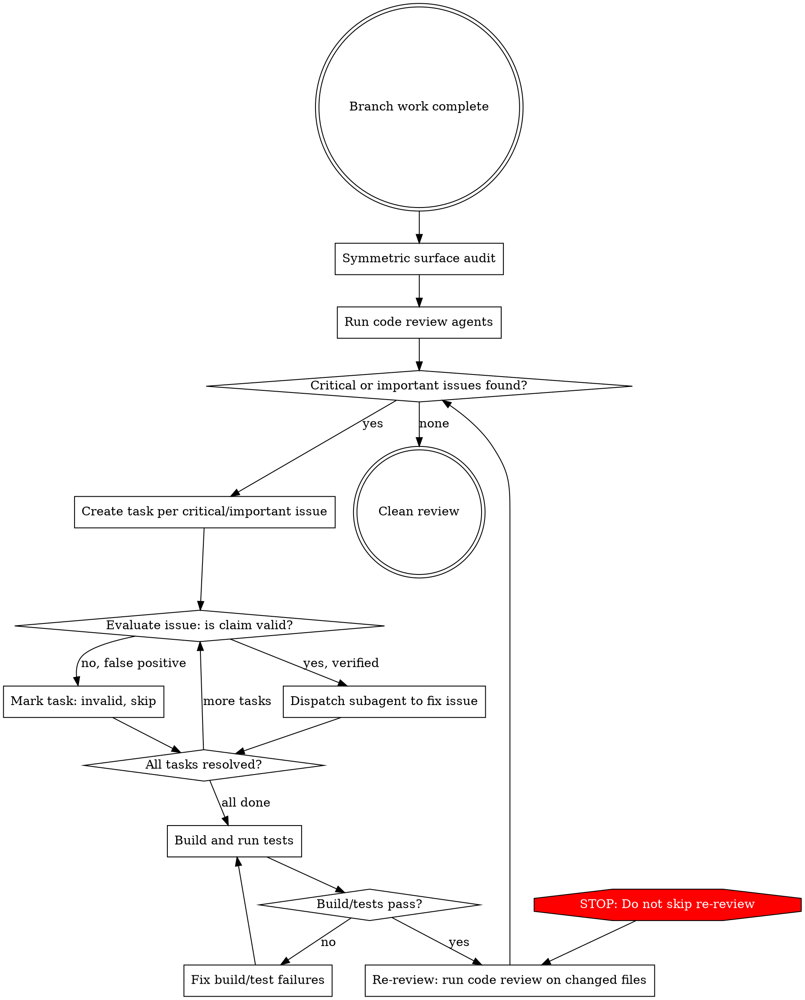

# Iterative Review and Fix

## Overview

Automated review-evaluate-fix loop that audits symmetric surfaces, uses specialized review agents, critically evaluates each finding, fixes only valid issues, and re-reviews until clean.

**Core principle:** Audit symmetric surfaces first, review with tools, evaluate with skepticism, fix with subagents, verify with re-review. Never stop until the review is clean.

## When to Use

- Branch work is complete and you want automated quality assurance before commit/PR
- After implementing a feature, before creating a PR
- When you want a thorough review without manual back-and-forth

## When NOT to Use

- Mid-implementation (finish the feature first)
- For a single file change (manual review is faster)
- When the user wants to review findings themselves before fixing

## The Loop



## Step-by-Step

### 1. Symmetric Surface Audit (Run First)

Code review agents read the diff — they cannot see _missing_ changes on files you did not touch. This step catches the failure mode where a feature is implemented on one half of a symmetric pair (e.g. create) but the sibling (e.g. edit) was forgotten.

**Invoke the `/symmetric-audit` skill.** It enumerates siblings for every changed file, renders one of three verdicts per sibling (**In sync** / **Diverged** / **Intentionally asymmetric**), and returns a written audit summary.

Feed the audit's **Diverged** findings into the task list created in Step 3 — they get evaluated and fixed alongside whatever the code review surfaces.

**Do not skip this step.** Code review reads the diff; the audit reads the _absence_ of changes on sibling files. They catch different bugs.

### 2. Run Comprehensive Review

Use whatever code review tooling is available in your environment. Options, in order of preference:

1. **`/code-review` skill** (if installed) — multi-agent review covering bugs, silent failures, test coverage, and more.
2. **`feature-dev:code-reviewer` agent** — single-agent code review focused on bugs, logic errors, and security.
3. **Manual review** — if no review agents are available, read the diff file-by-file.

The review should analyze the branch diff against the base branch (typically `main` or `develop`).

### 3. Filter to Critical and Important Only

From the review summary, extract ONLY items marked **Critical** or **Important** (or equivalent severity). Ignore suggestions, nits, and positive observations — they are not actionable in this loop.

Create a task (TaskCreate) for each critical/important issue with:

- The finding description
- The file and line reference
- The source that reported it (review agent name, or "symmetric audit" for findings from Step 1)

### 4. Evaluate Each Finding

For EACH finding, before fixing, apply this evaluation pattern:

```
READ:     What exactly does the review claim?
VERIFY:   Read the actual code at the referenced location
EVALUATE: Is this claim technically correct for THIS codebase?
DECIDE:   Fix (valid) or Skip (false positive)
```

**Check specifically:**

- Does the issue actually exist in the code? (Read the file)
- Is there existing infrastructure that handles this? (Grep for related patterns)
- Is the reviewer missing context? (Check git blame, related tests, config)
- Would this fix introduce new problems?

Mark invalid findings with reasoning and move on. Do not fix false positives.

**Guard against all-false-positive escape:** If you mark MORE THAN HALF of findings as false positives, pause and re-examine your evaluation criteria. Multiple agents independently flagging the same area is a strong signal. Present your false-positive rationale to the user before proceeding.

**Evaluation depth:** "Read the file" alone is insufficient. You MUST also:

- Grep for related patterns (middleware, validators, base classes that might handle this)
- Check if tests cover the scenario the reviewer flagged
- Read any configuration that affects the behavior

### 5. Fix Valid Issues with Subagents

For each valid finding, dispatch a subagent (Agent tool) with:

- The specific issue to fix
- The file(s) involved
- What the fix should accomplish
- Constraint: build must pass, existing tests must pass

**Use parallel subagents** when fixes are in independent files/domains. Use sequential when fixes overlap.

### 6. Build and Test

After all fixes are applied, run the project's build and test commands:

```bash
# Adapt these to your project
<build-command>      # e.g. npm run build, pnpm check-types, cargo check
<test-command>       # e.g. npm test, pnpm test, pytest
<lint-command>       # e.g. npm run lint, pnpm check
```

If build or tests fail, fix immediately before proceeding. Never skip to re-review with a broken build.

### 7. Re-Review (MANDATORY)

**This step is NOT optional.** After fixes, run the code review again, focused on the files that changed during fixes. **Also re-run the symmetric surface audit (Step 1) on the new diff** — fixes can introduce fresh asymmetry, especially when a subagent updates one sibling and forgets another.

This catches:

- Issues introduced by the fixes themselves
- Issues that were masked by the original problems
- Incomplete fixes
- Symmetry regressions introduced by partial fixes

### 8. Loop Until Clean

If the re-review finds new critical/important issues, go back to Step 3. There is no maximum iteration count — continue until the review comes back clean.

**If the same issue keeps recurring after 3 iterations:** Stop and ask the user. The fix approach may be fundamentally wrong.

## Red Flags — You Are About to Violate the Process

| Thought | Reality |
| --- | --- |
| "I changed create, so I'm done" | Almost every write-path has an edit counterpart. Run the symmetric audit before assuming the work is scoped. |
| "I'll skip the symmetric audit, the reviewer will catch it" | Code review reads the diff. It cannot see a missing change on a file you didn't touch. The audit fills that gap. |
| "I'll just read the code myself instead of running agents" | Agents provide specialized analysis. Use them when available. |
| "This finding is obviously correct, skip evaluation" | Obvious findings are often false positives. Always verify. |
| "One pass should be sufficient" | Fixes introduce new issues. Always re-review. |
| "I'll skip re-review since the fixes were small" | Small fixes can have big side effects. Re-review. |
| "The build passes so the fixes are fine" | Building != correct. Review catches logic errors. |
| "I'll fix the suggestions too while I'm at it" | Scope creep. Only critical and important. |
| "I can fix all these manually, no need for subagents" | Subagents provide isolation and focus. Use them for non-trivial fixes. |
| "All of these are false positives" | If >50% are false positives, re-examine your evaluation. Multiple agents flagging the same area is a strong signal. |
| "I'll evaluate by just reading the file" | Reading alone is insufficient. Grep for handlers, check tests, read config. |
| "The sibling looks fine, I'll skip writing a verdict" | Every sibling needs a written verdict — in-sync, diverged, or intentionally asymmetric. Silence is how gaps slip. |

## Common Mistakes

| Mistake | Fix |
| --- | --- |
| Skipping the symmetric surface audit | Run Step 1 before code review — it catches missing changes the diff can't reveal |
| Reflexively mirroring a change to siblings | Update IF AND ONLY IF the sibling genuinely diverged; many asymmetries are intentional |
| No written audit summary | Hand the user a list of every sibling considered and its verdict |
| Blindly fixing all findings | Evaluate each finding with the READ/VERIFY/EVALUATE/DECIDE pattern first |
| Skipping re-review after fixes | Re-review is mandatory, not optional |
| Stopping after one iteration | Loop until zero critical/important findings |
| Fixing suggestions alongside critical issues | Only fix critical and important in this loop |
| Not creating tasks for tracking | Create a task per finding for progress tracking |
